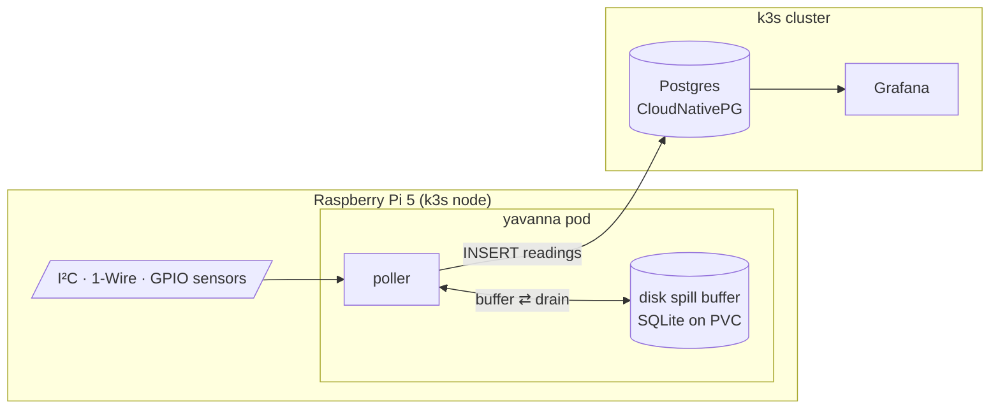

# Yavanna 🌱

**Yavanna is a self-hosted sensor telemetry service that monitors an indoor plant garden.** It runs as a container on a Raspberry Pi 5 in a [k3s](https://k3s.io) homelab cluster, polls the light, air-climate, and soil sensors wired to the Pi, and stores every reading in Postgres for live Grafana dashboards — with a disk-backed retry buffer so no reading is ever lost to a restart or database outage.

Named for the Vala of Tolkien's legendarium responsible for all things that grow. Formerly `auto-water`: the project began as a plant-*watering* experiment and evolved into a monitoring platform first — actuation (pumps and valves) may return later on this foundation.

## What it does

- Polls a configurable set of hardware sensors on an interval and normalizes readings into a single `readings` schema
- Survives failure: readings queue in memory, spill to SQLite on disk across restarts, and drain automatically when Postgres returns
- Manages its own schema with built-in, tested migrations (run as an init container on every deploy)
- Ships its Grafana dashboard as code — six live panels provisioned from this repo
- Deploys itself via GitOps: Flux watches this repo's `main`, and every production rollout is a versioned release commit

## Architecture



The poller is sink-agnostic: the same image runs on a bench with `SINK=stdout` and in production with `SINK=postgres`, with each sensor enabled and addressed through environment variables.

## Hardware

| Sensor | Interface | Measures |
|---|---|---|
| HDC302x | I²C | air temperature, relative humidity |
| BH1750 | I²C | illuminance (lux) |
| DS18B20 (×N) | 1-Wire | soil temperature, named per plant |
| ADS1115 + capacitive probes (×N) | I²C ADC | soil moisture (calibrated % and raw) |
| Resistive probe | GPIO | wet/dry digital line |

## Engineering highlights

- **Reliability by design** — local-first (works fully offline), bounded in-memory queue with SQLite spill-to-disk, automatic drain on recovery, heartbeat-file liveness probe, resilient per-sensor init (one failed sensor never takes down the poller).
- **GitOps deployment** — [Flux](https://fluxcd.io) syncs `deploy/` from `main`; the image tag is pinned in a single kustomize `images:` block, so cluster state is always attributable to a commit.
- **Versioned releases** — conventional commits + [release-please](https://github.com/googleapis/release-please): merging the auto-maintained release PR tags `vX.Y.Z`, builds the `linux/arm64` image to GHCR, and pins that exact tag into the manifests. Deploys only happen on releases.
- **Managed Postgres on the cluster** — [CloudNativePG](https://cloudnative-pg.io) operator, PodMonitor metrics, MetalLB LoadBalancer for workstation access.
- **CI on every PR** — ruff, bandit, pip-audit, pytest, CodeQL, and an arm64 container build check.

Stack: Python 3.13 · Postgres 18 · k3s on Raspberry Pi 5 · Flux · CloudNativePG · Grafana · GitHub Actions

## Repository layout

```
src/yavanna/       poller, config, health, migrations
  sensors/         one driver per sensor + factory
  sinks/           stdout (bench) and postgres (prod)
deploy/            k8s manifests — synced to the cluster by Flux
tests/             pytest suite
Containerfile      two-stage arm64 image (lgpio built from source)
compose.yaml       local Postgres + app for development
justfile           all dev/CI tasks
```

## Local development

Requires Python 3.13, [`just`](https://github.com/casey/just), and podman or docker.

```sh
python3 -m venv .venv && source .venv/bin/activate
pip install -r requirements-dev.txt

just ci      # lint (ruff), security (bandit, pip-audit), tests, build
just up      # local Postgres + app via compose
just dev     # run the poller on the bench with SINK=stdout
```

See [AGENTS.md](AGENTS.md) for conventions, and [LEARNINGS.md](LEARNINGS.md) / [COSTS.md](COSTS.md) for notes from the project's earlier AWS IoT incarnation.
